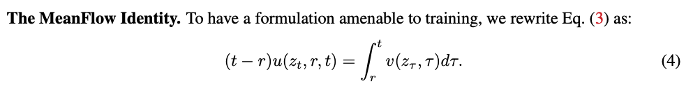

An unofficial PyTorch implementation of "Modular MeanFlow: Towards Stable and Scalable One-Step Generative Modeling" by Haochen You, Baojing Liu and Hongyang He - 2025

⚠️ Note: This is an unofficial implementation created for educational purposes. The official implementation by the authors is not yet available.

 🌟 What is MeanFlow?
MeanFlow is a groundbreaking approach to generative modeling that can create high-quality images in just one step, compared to traditional diffusion models that require hundreds of steps. The key insight is modeling average velocity instead of instantaneous velocity in the flow field.

### For better understand, I explain the things of MeanFlow like this one:

#### The Foundation: What is Average Velocity?
```
Average velocity = total displacement / time interval
```
it's basic physic

#### Fow path in Flow matching
In Flow Matching, we have a path z(t) that evolves over time t. The instantaneous velocity at any point is:
```
v(z_t, t) = dz/dt
```
The displacement from time r to time t is found by integrating the velocity:
```
Displacement = z_t - z_r = integral(r, t) v(z_w, w) dw 
```
Basically, if you know the velocity at each moment, you can find the distance by integrating

So,
```
Average velocity = integral(r, t) v(z_w, w) dw / (t-r)
=> avg_velocity (t-r) = integral(r, t) v(z_w, w) dw
```
as we can say in the paper avg_velocity = u(z_t, t, r) 
```
u(z_t, t, r) (t-r) = integral(r, t) v(z_w, w) dw
```


So now we take the derivatie, differentiate both sides with repspect to t:

```
d/dt[u(t-r)] = d/dt [integral(r,t) v dw]

=> du/dt (t-r) + u = v
=> u = v - du/dt (t-r)
=> u(z_t, r, t) = v(z_t, t) - du / dt (t-r)

we have, 
du/dt = (dz/dt)(∂u/∂z) + (dr/dt)(∂u/∂r) + (dt/dt)(∂u/∂t)
then du/dt = v(z_t, t) (∂u/∂z) + 0(∂u/∂r) + 1(∂u/∂t)
because dz/dt = v, dr/dt = 0, dt/dt = 1
so JVP will have tangents vector is (v, 0, 1)

We want to calculate the how the z change in range time [r, t] so the inputs are (z, r, t) and the function is our network

We also have
# Inputs to JVP
function = u_θ  # our neural network
inputs = (z, r, t)  # current inputs
tangents = (v, 0, 1)  # direction of change

# JVP returns
u_value, du_dt = jvp(function, inputs, tangents)

=> u_pred, du/dt = JVP(net, (z, r, t), (v, 0, 1))

```


 🌟 What is Modular MeanFlow?

The authors propose a flexible framework that extends the MeanFlow formulation with tunable gradient modulation.

The core innovation is a gradient modulation mechanism using a parameter λ that controls how gradients flow through the model:

- λ = 0: full stop-gradient (maximum stability, less expressiveness)
- λ = 1: full gradient propagation (maximum expressiveness, potential instability)
- Curriculum scheduling: gradually increasing λ from 0 to 1 during training

The main different with MeanFlow contributed here:

```
def sg_lambda(x, lambda_val):
    """
    function SGλ[z] = λ·z + (1-λ)·stopgrad(z)
    - lambda_val = 1: full gradient propagation
    - lambda_val = 0: full stop-gradient
    """
    return lambda_val * x + (1 - lambda_val) * stopgrad(x)
```

 🌟 The Core Problem

While MeanFlow needs:

1. The avg velocity field u(x_t, r, t)
2. How this field changes with respect to time and position (derivatives sigma_t and delta x_u)
The full MeanFlow identity requires:  
```
v(x_t, t) = u(x_t, r, t) + (t-r) · d/dt u(x_t, r, t)
```
This created a circular dependency: model used it's own value to penalty itself so we need something that can schedule gradient modulation to the derivative term